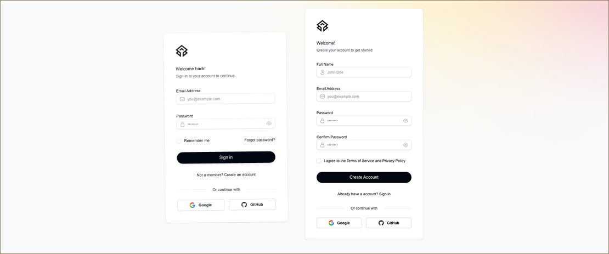

## Authen

Authentication system built with Next.js, TypeScript, NextAuth, and MongoDB.



### Overview

Authen is a simple authentication system that showcases how to implement user login and registration in web applications. It demonstrates the integration of Next.js with NextAuth.js for social login providers, along with MongoDB for storing user information.

### Features:

- 🔐 Multiple authentication providers (Google, GitHub)
- 👤 User management with MongoDB
- 🛡️ Role-based authorization
- 📝 Form validation with Zod
- 🎨 Customizable UI components (built with Headless UI & Tailwind CSS)
- 📱 Responsive design
- 🌐 TypeScript support for end-to-end type safety
- 🔄 Session management with NextAuth.js
- 📨 Toast notifications for user feedback

### Technologies:

- Framework: Next.js
- Authentication: NextAuth.js
- Database: MongoDB
- Language: Typescript
- Form Management: React Hook Form
- Validation: Zod
- UI Components: Headless UI
- Styling: Tailwind CSS

### Installation

```bash
# Clone the repository
git clone https://github.com/yourusername/authen.git
cd authen

# Install dependencies
npm install
```
